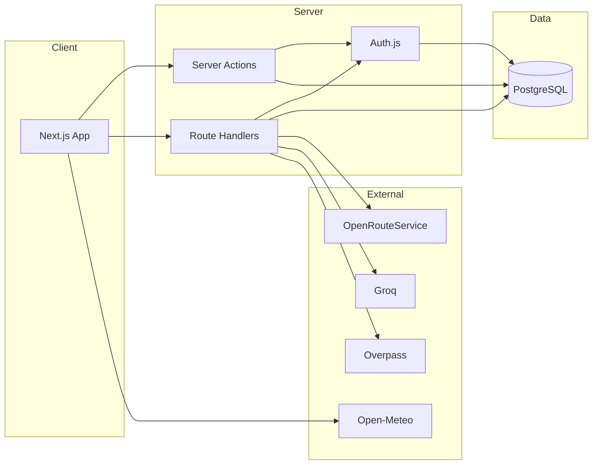

<div align="center">

<!-- ═══════════════════════════════════════════════════════════
     HERO BANNER — Ghoomora × forest teal
     ═══════════════════════════════════════════════════════════ -->


<br/>

### Travel planning for real northern roads

Regions · Packages · Trip builder · Maps · Weather · Safety · Bookings · Role-based ops  
— one Next.js app, built on a modern free & open-source stack.

<br/>


<br/>

<!-- ═══════════════════════════════════════════════════════════
     STICKER / BADGE STRIP
     ═══════════════════════════════════════════════════════════ -->

[](https://www.typescriptlang.org/)
[](https://nextjs.org/)
[](https://react.dev/)
[](https://nodejs.org/)
[](https://www.postgresql.org/)
[](https://www.prisma.io/)

<br/>

[](#license)
[](#-tech-stack)
[](#-features)
[](#-features)
[](#-tech-stack)

<br/>

[](https://github.com/Bixal99/Ghoomora)
[](https://github.com/Bixal99/Ghoomora/fork)
[](https://github.com/Bixal99/Ghoomora/issues)

</div>

---

## ✨ At a Glance

<table>
<tr>
<td width="33%" align="center">

### ⛰ Discovery
Regions · destinations · seasons  
verified packages · tiered pricing

</td>
<td width="33%" align="center">

### 🧭 Plan & Go
Trip builder · AI suggestions  
route maps · weather · safety

</td>
<td width="33%" align="center">

### 🔐 Role Portals
Customer · Vendor · Admin  
fleet · hotels · camps · guides

</td>
</tr>
</table>

**Core flow**

```text
Browse Regions  →  Destinations & Packages  →  Configure Tier / Days / Pickup
        ↓                                              ↓
  Trip Builder / AI                        Live Pricing & Route Map
                                                   ↓
                                      Checkout → PDF E-Voucher
```

---

## 🧩 Tech Stack

<div align="center">

### Frontend & Motion
<br/>

[](https://skillicons.dev)

| | Tool | Role |
|:---:|:---|:---|
| ⬛ | **Next.js 16** | App Router · landing · catalog · portals |
| 🔷 | **TypeScript** | End-to-end type safety |
| 💨 | **Tailwind CSS v4** | Utility-first travel UI |
| 🧩 | **Radix · shadcn-style** | Accessible primitives |
| ✨ | **Framer Motion** | App-wide motion |
| 🎞 | **GSAP + Three.js** | Landing hero only |
| 🗺 | **MapLibre GL** | Route maps & elevation |
| 📊 | **Recharts** | Partner & admin analytics |

<br/>

### Backend & Data
<br/>

[](https://skillicons.dev)

| | Tool | Role |
|:---:|:---|:---|
| 🟢 | **Node.js · Next.js** | Server Actions · Route Handlers |
| 🔺 | **Prisma 7** | Typed ORM · migrations · Studio |
| 🐘 | **PostgreSQL** | System of record + Auth sessions |
| 🔑 | **Auth.js v5** | Credentials · Google · DB sessions |
| ✉️ | **Resend** | Sign-up OTP · password reset |
| 🧾 | **React-PDF** | Itemized booking vouchers |
| ☁️ | **Cloudinary** | Images · vendor documents |

<br/>

### Integrations · Tooling
<br/>

[](https://skillicons.dev)

| | Tool | Role |
|:---:|:---|:---|
| 🛣 | **OpenRouteService** | Multi-waypoint routing · elevation |
| 🌤 | **Open-Meteo** | Destination weather advisories |
| 🛡 | **Overpass / OSM** | Hospitals · police · fuel · checkpoints |
| 🤖 | **Groq (Llama)** | AI trip planner (demo without key) |
| 📡 | **Pusher** | Optional live trip tracking |
| 📦 | **Zod 4** | Validation for forms & actions |
| 🧪 | **Vitest** | Unit tests (pricing, auth, weather, …) |

</div>

---

## 🌟 Features

<table>
<tr>
<td valign="top" width="50%">

#### 🎒 Travelers
Region explorer · package catalog · trip builder · live pricing configurator · MapLibre routes · weather badges · safety dashboard · checkout · PDF e-vouchers

#### 🏪 Partners (Vendors)
Unified onboarding · vendor application · fleet · hotels · camps · guides · package editor · live fare inputs

#### 🚙 Transport Pricing
Two layers — city→region pickup fares **and** local 4×4 day-hire — always itemized, never opaque

</td>
<td valign="top" width="50%">

#### 🛡 Admins
Vendor approvals · verification · platform analytics · single bootstrap admin (`ADMIN_*`)

#### 🔐 Auth
Email/password + OTP · Google OAuth · password reset · database sessions · role gates

#### 📡 Extras
Groq AI itinerary assist · Cloudinary uploads · optional Pusher live tracking

</td>
</tr>
</table>

<div align="center">

### Roles at a glance


</div>

---

## 📋 Prerequisites

| Requirement | Notes |
|:---|:---|
| **Node.js ≥ 20** · **npm** | Local development |
| **PostgreSQL** | Local (e.g. pgAdmin) or Neon / compatible for production |
| **Auth secret** | Generate with `npx auth secret` |
| **Resend / ORS / Groq** *(optional)* | Email, routes, AI — free tiers work |

---

## 🚀 First-Time Setup

```powershell
# 1. Install
npm install

# 2. Environment
Copy-Item .env.example .env
# Fill DATABASE_URL, AUTH_SECRET, NEXT_PUBLIC_APP_URL, ADMIN_* …

# 3. Database + admin
npm run db:migrate
npm run admin:create

# 4. Develop
npm run dev
```

| App | URL |
|:---|:---|
| 🌐 **Web** | [http://localhost:3000](http://localhost:3000) |

> Regions, destinations, and pickup cities are **not** auto-seeded — add them via Prisma Studio. See [`docs/ADDING_REAL_DATA.md`](docs/ADDING_REAL_DATA.md).

Environment template: [`.env.example`](.env.example). Copy to `.env` (gitignored) — **never commit real secrets**.

---

## 🔐 Environment Variables

| Variable | Purpose |
|:---|:---|
| `DATABASE_URL` | PostgreSQL — also backs Auth.js sessions |
| `AUTH_SECRET` | Auth.js signing secret (`npx auth secret`) |
| `AUTH_URL` | Auth base URL (e.g. `http://localhost:3000`) |
| `NEXT_PUBLIC_APP_URL` | App origin for metadata / links |
| `ADMIN_EMAIL` / `ADMIN_PASSWORD` / `ADMIN_NAME` | Bootstrap admin only (`npm run admin:create`) |
| `RESEND_API_KEY` / `EMAIL_FROM` | OTP + password reset *(optional)* |
| `AUTH_GOOGLE_ID` / `AUTH_GOOGLE_SECRET` | Google OAuth *(optional)* |
| `ORS_API_KEY` | OpenRouteService routes *(optional)* |
| `GROQ_API_KEY` | AI trip planner *(optional — demo fallback)* |
| `CLOUDINARY_*` | Uploads *(optional)* |
| `PUSHER_*` / `NEXT_PUBLIC_PUSHER_KEY` | Live tracking *(optional)* |

> Test Resend sender (`onboarding@resend.dev`) only delivers to your Resend account email — other addresses log the OTP in the `npm run dev` terminal.

---

## 📜 Scripts

| Command | Purpose |
|:---|:---|
| `npm run dev` | Start development server |
| `npm run build` | Production build (`prisma generate` + `next build`) |
| `npm run start` | Start production server |
| `npm run typecheck` | TypeScript check |
| `npm test` | Vitest unit tests |
| `npm run lint` | ESLint |
| `npm run db:migrate` | Apply Prisma migrations |
| `npm run db:generate` | Regenerate Prisma client |
| `npm run admin:create` | Create bootstrap admin from `ADMIN_*` |

---

## 🗺 Key Routes

| Area | Routes |
|:---|:---|
| **Public** | `/` · `/regions/[slug]` · `/destinations/[slug]` · `/packages` · `/packages/[id]` · `/trip-builder` · `/checkout` |
| **Auth** | `/sign-in` · `/sign-up` · `/verify-email` · `/forgot-password` · `/reset-password` |
| **Account** | `/profile` · `/bookings` · `/bookings/[id]` |
| **Partner** | `/dashboard` · `/fleet` · `/hotels` · `/camps` · `/guide-profile` · `/vendor/packages` |
| **Admin** | `/approvals` · `/analytics` |

---

## 🗂️ Project Layout

```text
ghoomora/
├── app/                     # Next.js App Router pages + Server Actions + API
│   ├── actions/             # auth, booking, vendor, admin, pricing, …
│   ├── api/                 # auth, ai-planner, route, safety, tracking, voucher
│   ├── packages/            # catalog + configurator
│   ├── trip-builder/        # matching + AI
│   ├── dashboard/           # partner portal
│   └── approvals/           # admin review
├── components/              # UI, maps, auth, hero, vouchers
├── lib/                     # data, pricing, auth, AI, weather, Overpass
├── prisma/                  # schema + migrations
├── scripts/                 # create-admin.ts
├── tests/                   # Vitest
├── docs/                    # operator docs + README assets
├── auth.ts                  # Auth.js config
└── proxy.ts                 # role-based gates (Next.js 16)
```

<div align="center">



</div>

---

## 🧭 Partner & Admin Notes

1. Every account starts as **CUSTOMER**. Apply from `/profile` → **Become a vendor**.
2. Admin reviews at `/approvals` — approve creates `VENDOR` + profile in one transaction.
3. Partners add fleet / hotels / camps / guides, then packages at `/vendor/packages`.
4. Verified packages appear in the public catalog.
5. Bootstrap admin: set `ADMIN_*` → `npm run admin:create` (no admin sign-up in the app).

**Price formula**

```text
total =
  pickupFare(vehicle, mode, pickupCity, region)
+ tier.pricePerPersonPerDay × days × travelers
+ Σ localHireRate   // stops with requiresLocalTransport
```

---

## ✅ Validation

```powershell
npm run typecheck
npm test
npx prisma validate
npm run build
```

---

## 📚 Docs

| Doc | Contents |
|:---|:---|
| [`docs/ADDING_REAL_DATA.md`](docs/ADDING_REAL_DATA.md) | Regions, destinations, pickup cities |
| [`docs/GEOCODING_BACKLOG.md`](docs/GEOCODING_BACKLOG.md) | Geocoding notes before seeding |
| [`.env.example`](.env.example) | Full env template |

---

## 📄 License

**Private / unpublished** — for Ghoomora development. All rights reserved.

---

<div align="center">


<br/>

**[⬆ Back to top](#-at-a-glance)**

<br/>

<sub>Ghoomora · Northern Pakistan · Next.js · Prisma · PostgreSQL · Auth.js · MapLibre</sub>

</div>
