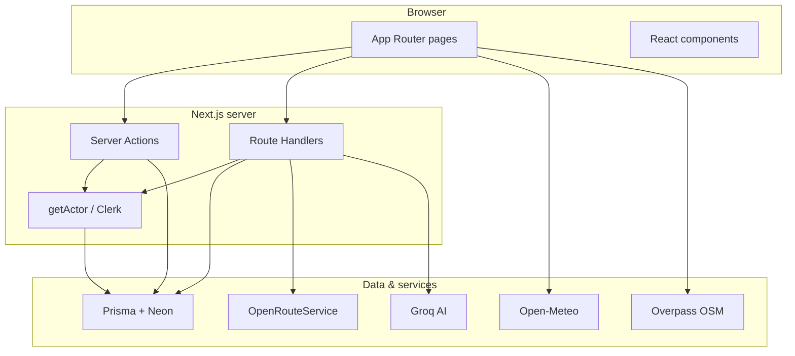

<div align="center">

# Ghoomora

**Northern Pakistan, thoughtfully planned.**

Discover mountain regions, compare verified trip packages, and plan with local operators — built for the roads, seasons, and transport realities of Gilgit-Baltistan, Kashmir, and Khyber Pakhtunkhwa.

<br />

[](https://nextjs.org/)
[](https://react.dev/)
[](https://www.typescriptlang.org/)
[](https://tailwindcss.com/)
[](https://www.prisma.io/)
[](https://clerk.com/)

[Explore the app](#quick-start) · [Routes](#key-routes) · [Partner portal](#for-partners) · [Admin](#for-admins)

</div>

---

## What is Ghoomora?

Ghoomora is a full-stack travel platform that connects travelers with verified northern Pakistan operators. It treats **pickup transport** and **local 4×4 day-hire** as separate line items, surfaces weather and safety context at the destination level, and gives partners one dashboard to manage fleet, hotels, guides, camps, and packages.

> *Go beyond the postcard.* Every destination belongs to a real region in the database — browse by geography first, then narrow by season, altitude, trip length, and comfort tier.

---

## Features

### For travelers

| Feature | Description |
| --- | --- |
| **Region explorer** | Browse Gilgit-Baltistan, Kashmir, and KPK with elevation, season, and terrain context |
| **Package catalog** | Compare Standard, Moderate, and Luxury tiers with transparent, itemized pricing |
| **Trip builder** | Match packages to your constraints; optional AI-assisted itinerary suggestions |
| **Route maps** | MapLibre visualization with elevation profiles via OpenRouteService |
| **Weather advisories** | Open-Meteo forecasts with risk badges (model-based, not road closures) |
| **Safety dashboard** | Nearby hospitals, police, fuel, and checkpoints via Overpass / OpenStreetMap |
| **Checkout & vouchers** | Complete bookings and download itemized PDF e-vouchers |

### For partners

| Feature | Description |
| --- | --- |
| **Unified onboarding** | One account can represent transport, hotels, guides, camps — or any combination |
| **Inventory management** | Fleet, hotels, camps, guide profiles, and package editor |
| **Live pricing inputs** | Pickup fares, local day-hire rates, and room tiers feed the configurator |
| **Approval workflow** | Submit profile for review; admin verification unlocks public visibility |
| **Partner dashboard** | Overview of vehicles, properties, and packages at a glance |

### For admins

| Feature | Description |
| --- | --- |
| **Vendor approvals** | Review and verify partner profiles at `/approvals` |
| **Analytics** | Platform-level insights at `/analytics` |
| **Role assignment** | Admin access via `ADMIN_EMAILS` in environment config |

---

## Stack

| Layer | Technology |
| --- | --- |
| **Framework** | Next.js 16 (App Router), React 19, TypeScript |
| **Styling & motion** | Tailwind CSS 4, Poppins, Framer Motion, GSAP, Three.js hero scene |
| **Database** | Prisma 7 + PostgreSQL (Neon) |
| **Auth** | Clerk with webhook sync to Neon |
| **Maps & routing** | MapLibre GL, OpenStreetMap, OpenRouteService |
| **Weather & safety** | Open-Meteo, Overpass API |
| **AI** | Groq (`llama-3.3-70b-versatile`) — demo mode without API key |
| **Realtime** | Pusher (optional live trip tracking) |
| **Documents** | `@react-pdf/renderer` booking vouchers |
| **Validation** | Zod 4 |

---

## Architecture



---

## Quick start

### Prerequisites

- **Node.js 20+**
- A [Neon](https://neon.tech) PostgreSQL database
- A [Clerk](https://clerk.com) application (publishable + secret keys)

### 1. Clone and install

```powershell
git clone <your-repo-url>
cd travel_ui_ux-main
npm install
```

### 2. Configure environment

Your **`.env` file stays on your machine** — it is in `.gitignore` and must never be committed.

```powershell
Copy-Item .env.example .env
```

Open `.env` and fill in your credentials. Use `.env.example` as the reference template.

#### Required variables

| Variable | Purpose |
| --- | --- |
| `DATABASE_URL` | Neon PostgreSQL connection string |
| `NEXT_PUBLIC_CLERK_PUBLISHABLE_KEY` | Clerk frontend key |
| `CLERK_SECRET_KEY` | Clerk backend key |
| `CLERK_WEBHOOK_SIGNING_SECRET` | Verify `/api/webhooks/clerk` events |
| `ADMIN_EMAILS` | Comma-separated admin emails (case-insensitive) |
| `NEXT_PUBLIC_APP_URL` | App origin, e.g. `http://localhost:3000` |

#### Recommended & optional

| Variable | Purpose |
| --- | --- |
| `ORS_API_KEY` | Package route visualization (OpenRouteService) |
| `GROQ_API_KEY` | AI trip planner — falls back to demo suggestions without it |
| `NEXT_PUBLIC_PUSHER_KEY`, `PUSHER_*` | Live trip tracking |
| `CLOUDINARY_*` | Image uploads |

> **Security:** If `.env` was ever pushed to a remote, rotate every secret (Neon, Clerk, Groq, Cloudinary, Pusher, ORS) before deploying.

### 3. Set up the database

```powershell
npm run db:migrate
npm run db:seed
```

This creates the schema and seeds regions, destinations, sample packages, and demo inventory.

### 4. Configure Clerk

1. In the Clerk dashboard, add a webhook endpoint:
   ```
   https://<your-domain>/api/webhooks/clerk
   ```
2. Subscribe to **`user.created`** and **`user.updated`**.
3. Copy the signing secret into `CLERK_WEBHOOK_SIGNING_SECRET`.

Partner sign-in uses `/sign-in` and redirects to `/dashboard` after authentication. On localhost, user profiles sync on first sign-in even without webhooks.

### 5. Run locally

```powershell
npm run dev
```

Open **[http://localhost:3000](http://localhost:3000)**.

Without full credentials, public routes run in **sample-data mode**. Protected partner and admin pages show setup guidance instead of failing silently.

---

## Key routes

### Public

| Route | Description |
| --- | --- |
| `/` | Landing — hero, regions, featured destinations |
| `/regions/[slug]` | Region explorer with destination cards |
| `/destinations/[slug]` | Detail, weather forecast, safety amenities |
| `/packages` | Verified package catalog with filters |
| `/packages/[id]` | Live pricing configurator + route map |
| `/trip-builder` | Match packages + AI-assisted planning |
| `/checkout` | Complete a booking |
| `/sign-in` · `/sign-up` | Clerk authentication |

### Partner

| Route | Description |
| --- | --- |
| `/dashboard` | Partner overview and onboarding |
| `/fleet` | Vehicle inventory |
| `/hotels` | Hotel and room tiers |
| `/camps` | Camp listings |
| `/guide-profile` | Guide profile editor |
| `/vendor/packages` | Package builder |

### Admin

| Route | Description |
| --- | --- |
| `/approvals` | Verify or revoke partner profiles |
| `/analytics` | Platform analytics |

### Account

| Route | Description |
| --- | --- |
| `/profile` | User profile |
| `/bookings/[id]` | Booking detail, status, PDF voucher download |

---

## For partners

1. **Sign up** at `/sign-up` and complete the partner profile on `/dashboard`.
2. Add inventory — fleet, hotels, camps, or guides depending on your services.
3. Create packages at `/vendor/packages` with stops, tiers, and day ranges.
4. Wait for admin approval — your dashboard shows **Awaiting approval** until verified.
5. Once verified, packages become visible in the public catalog.

---

## For admins

1. Add your email to `ADMIN_EMAILS` in `.env` and restart the dev server.
2. Sign in with that account.
3. Open **`/approvals`** (also linked in the site footer as *Admin approvals*).
4. Click **Approve vendor** on the pending partner card.

Verification controls public package visibility. Partners cannot approve themselves from the dashboard.

---

## Scripts

| Command | Description |
| --- | --- |
| `npm run dev` | Start development server |
| `npm run build` | Production build (includes `prisma generate`) |
| `npm run start` | Start production server |
| `npm run typecheck` | TypeScript check |
| `npm test` | Vitest unit tests |
| `npm run lint` | ESLint |
| `npm run db:migrate` | Apply Prisma migrations |
| `npm run db:seed` | Seed regions, destinations, sample packages |
| `npm run db:generate` | Regenerate Prisma client |

---

## Project layout

```
app/
  page.tsx                  # Home — hero, regions, featured destinations
  loading.tsx               # Full-screen hero loader (GSAP + Framer Motion)
  trip-builder/             # Trip matching + AI planner
  packages/                 # Catalog, detail, and configurator
  destinations/[slug]/      # Destination detail, weather, safety
  regions/[slug]/           # Region explorer
  checkout/                 # Booking checkout
  bookings/[id]/            # Booking detail + PDF voucher
  dashboard/                # Partner onboarding & overview
  fleet/ hotels/ camps/     # Partner inventory
  vendor/packages/          # Partner package editor
  analytics/ approvals/     # Admin dashboards
  api/
    ai-planner/             # AI itinerary + cost estimation
    bookings/[id]/voucher/  # PDF e-voucher download (GET)
    webhooks/clerk/         # User sync webhook

components/
  loading-screen.tsx        # Animated route transition loader
  hero-scene.tsx            # Three.js + GSAP hero background
  reactbits/                # Gradient text and UI effects
  map/                      # Route maps, elevation charts
  ai-trip-assistant.tsx     # AI planning form

lib/                        # Data, pricing, auth, AI, weather, Overpass
prisma/                     # Schema, migrations, seed data
proxy.ts                    # Clerk middleware (Next.js 16)
```

---

## Product principles

**Two-layer transport pricing**
Pickup fares (bus/car from major cities) and local 4×4 day-hire are priced separately. Luxury tier may bundle local transport; Standard and Moderate show it as its own line.

**Weather badges**
Open-Meteo advisories are model-based indicators — they are not confirmed road closures or official warnings.

**Safety data**
Overpass amenity lookups degrade gracefully when public mirrors are slow or unavailable.

**AI suggestions**
The trip planner only references destinations already in Ghoomora's database. Set `GROQ_API_KEY` for live AI; otherwise demo suggestions are returned.

**Geocoding**
See [`docs/GEOCODING_BACKLOG.md`](docs/GEOCODING_BACKLOG.md) before adding destinations outside the seeded coordinate network.

---

## Validation

Run before opening a pull request or deploying:

```powershell
npm run typecheck
npm test
npx prisma validate
npm run build
```

---

## License

Private project. All rights reserved.

---

<div align="center">

**Ghoomora** — *Built for real roads.*

</div>
